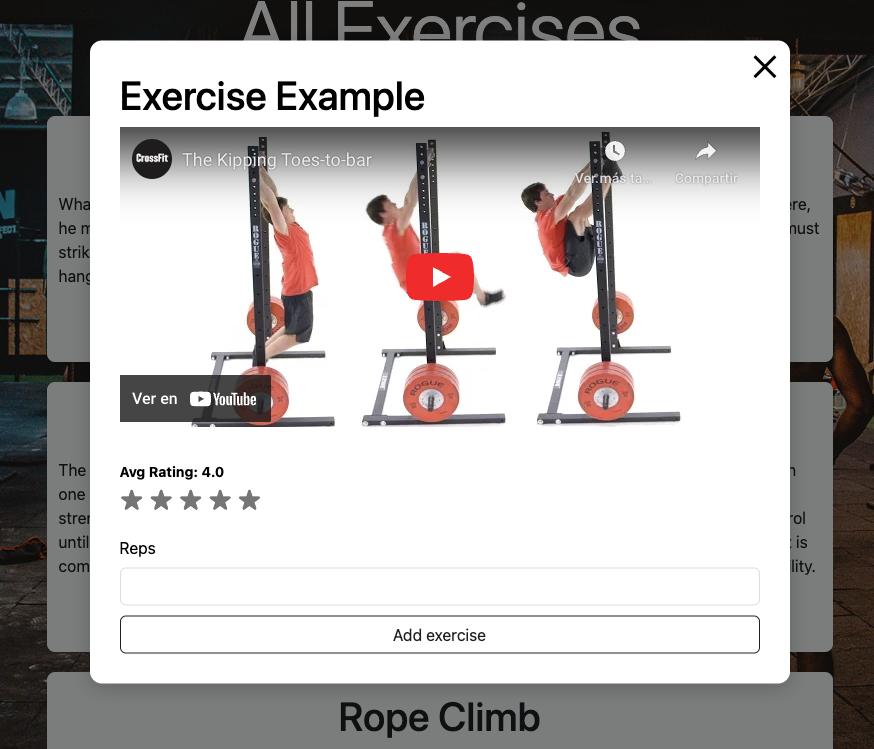

# Gym App Frontend
> Live demo [_here_](https://gym-app-frontend-8mg5.onrender.com). <!-- If you have the project hosted somewhere, include the link here. -->

## Table of Contents
* [General Info](#general-information)
* [Technologies Used](#technologies-used)
* [Features](#features)
* [Screenshots](#screenshots)
* [Setup](#setup)
* [Project Status](#project-status)
* [Room for Improvement](#room-for-improvement)
* [Contact](#contact)
<!-- * [License](#license) -->

## General Information
- Why I build this app? Well a lot of the normal people (Including me) struggle to track workouts, find new exercises, or create personalized routines without having to rely on scattered notes or separate apps. This Gym Fitness App centralizes all workout-related activities, helping users stay organized, motivated, and consistent in their fitness journey.
<!-- You don't have to answer all the questions - just the ones relevant to your project. -->

## Technologies Used
- JavaScript - version 23.6.1
- Bootstrap - version 5.3.5
- HTML
- CSS

## Features
List the ready features here:
- The user can have and edit it's own workout
- The user can see example videos from youtube
- The user can rate the exercises
- The user needs an account for create a exercise or add a exercise to it's workout

## Screenshots
- Exercise example

- Workout page

- Authentication requirement

## Setup
- I will recomend to have the versions of Bootstrap and the languages up to date.
- Then proceed to clone the app and run `npm install` and you should be good to go.

## Project Status
Project is: _complete_ 

## Room for Improvement
This app still have a big room for improvement with this app, and this is some of the things i want to add in the future.

Room for improvement:
- Have a home page with a better fexibility and access to all pages
- Better display of exercises and examples
- Authentication needs to me more strong and secure 

To do:
- Feature to be added 1:
  A community seccion for users to share their experience with the exercises and workouts.
- Feature to be added 2:
  A page of pre-build workouts.
- Feature to be added 3:
  A AI that helps you build or build a workout for the user.
- Feature to be added 4:
  A Good habits for the user to find information about: How to have better discipline? or Examples for a good alimentation.
- Feature to be added 5:
  Make it a Mobile App

## Contact
Created by Adrian Rodriguez 
- Email: adrianapps.345@gmail.com 
- Feel free to contact me!
